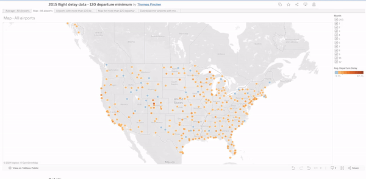

# TableauFlights

A remake of my portfolio website, 3 months on from when I first started development.

This project is hosted [here](https://public.tableau.com/app/profile/thomas.pincher/viz/2015flightdelaydata-120departureminimum/Dashboardforairportswithmorethan120departures?publish=yes/)

## Requirements / Purpose

The project was completed as a part of the [Udacity](https://www.udacity.com/)[Business Analytics Nanodegree](https://www.udacity.com/course/business-analytics-nanodegree--nd098?promo=year_end&coupon=SPRING50&utm_source=gsem_brand&utm_source=gsem_brand&utm_medium=ads_r&utm_medium=ads_r&utm_campaign=19167921312_c_individuals&utm_campaign=19167921312_c_individuals&utm_term=143524474959&utm_term=143524474959&utm_keyword=udacity%20business%20analytics_e&utm_keyword=udacity%20business%20analytics_e&gad_source=1&gclid=CjwKCAjw5v2wBhBrEiwAXDDoJQXhuSwILb3BRfwLyrbmmsFboI00QJa2HlkZUJWNgzhysMXvYDGUORoC7hoQAvD_BwE).

- TypeScript
- React
- Sass

## Design Goals / Approach

One thing I have always had difficulty with was styling an app that looked like it was made after 2000. I played with verticality and a generated colour theme, along with
some more complex styling than I'd used previously to make something a little more modern.

## Features

In this rebuild I was particularly happy to move away from the HTML address tag, and went with a third party to get form submission working correctly. I'm also quite happy
with how updateable the projects section is. The project data is all kept in a file at the root level, which keeps the project code cleaner. This was a big improvement from
the massive chunks of copy inside the code from my last iteration.

## Known issues

The app is not yet mobile responsive, which will need some updating. The links at the top-right are also displaying in the wrong colour prior to being visited on some browsers.

## Future Goals

Fixing the two issues above, and maybe adding links to \_nology and udacity.

## What did you struggle with?

- Styling still needs work, but that will come with time. This project was great to work through my understanding of TypeScript and managing form submission outcomes.
